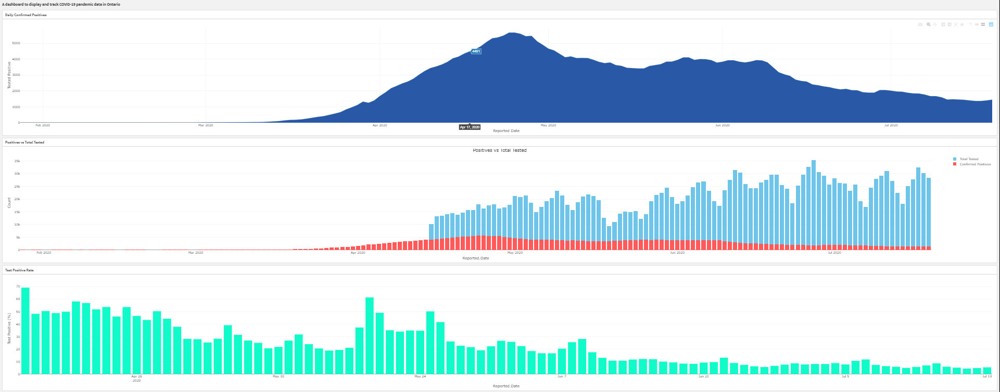
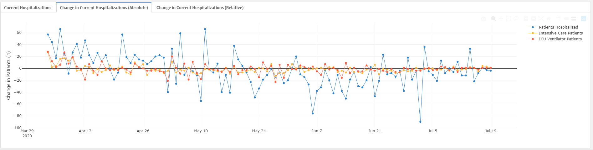
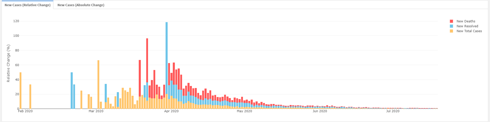
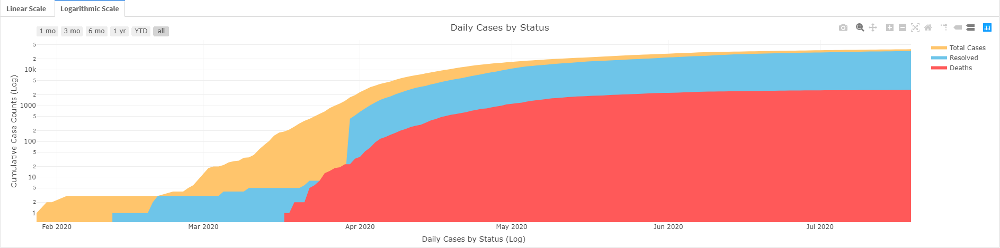
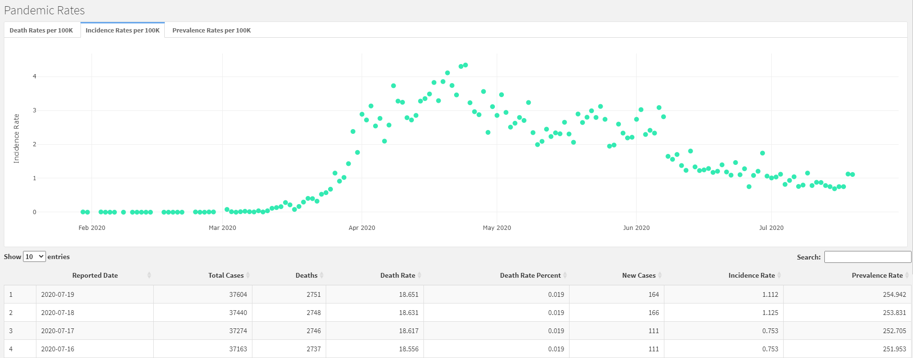
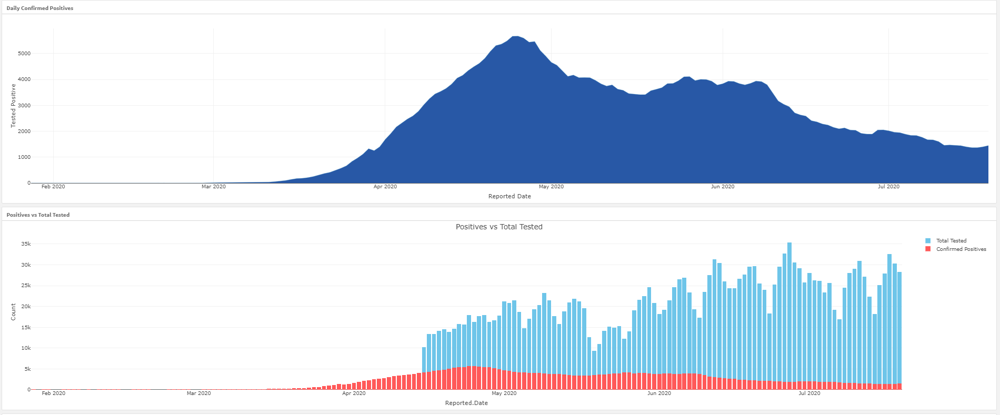
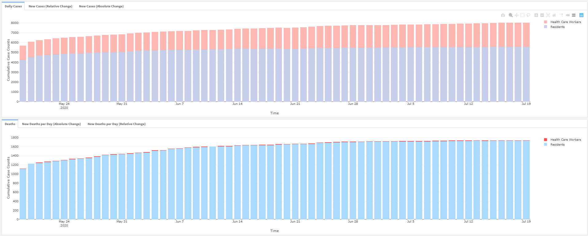

# Ontario Covid19 Tracker Dashboard
A tracker app I created to pull the most recent COVID-19 open data numbers from Ontario Public Health, manipulate, clean, transform and then visualize the data in neat dashboard with fully interactive graphics 

### Full Dashboard can be accessed [here](https://patrickschnurbusch.shinyapps.io/ON_Dashboard/)
*Note: Last updated - August 11th, 2020* 

Dataset used was provided by the [Goverment of Ontario](https://www.ontario.ca/) through their open source data catalogue and is updated daily.

This dataset is free to use and can be obtained here. Many thanks to the Government of Ontario for open sourcing this [COVID-19 dataset](https://data.ontario.ca/dataset/status-of-covid-19-cases-in-ontario). Without open sourced datasets, dashboards like this would not be possible.

